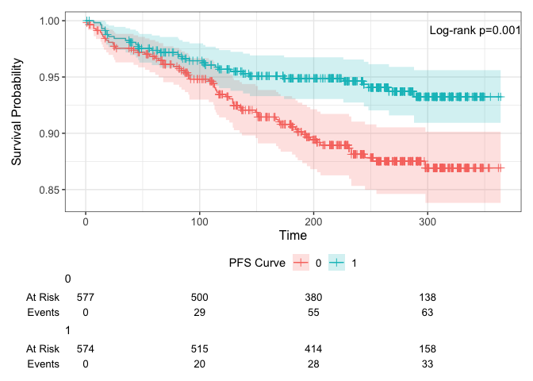
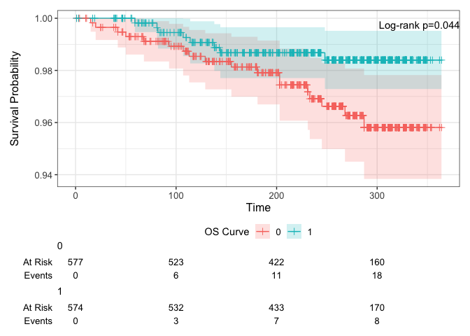

Midterm Project
================
Camille Okonkwo
2024-02-26

### Step 0: Data Preparation

``` r
# loading data
midtermdata = read_csv("data/midtermdata.csv")
```

    ## Rows: 1151 Columns: 15
    ## ── Column specification ────────────────────────────────────────────────────────
    ## Delimiter: ","
    ## dbl (15): id, time, censor, time_d, censor_d, tx, strat2, sex, raceth, ivdru...
    ## 
    ## ℹ Use `spec()` to retrieve the full column specification for this data.
    ## ℹ Specify the column types or set `show_col_types = FALSE` to quiet this message.

``` r
# combining categories, creating factor variables, and labelling

# Recode the variables
midtermdata$tx <- factor(
  midtermdata$tx,
  levels = c("0", "1"))

midtermdata$strat2 <- factor(
  midtermdata$strat2,
  levels = c("1", "0"))

midtermdata$sex <- factor(
  midtermdata$sex,
  levels = c("2", "1"))
  
midtermdata$raceth <- factor(
  ifelse(midtermdata$raceth %in% c(3, 4, 5, 6), 6, midtermdata$raceth),
  levels = c("1", "2", "6"))

midtermdata$ivdrug <- factor(
  ifelse(midtermdata$ivdrug %in% c(2, 3), 2, midtermdata$ivdrug), 
  levels = c("2", "1"))

midtermdata$hemophil <- 
  factor(midtermdata$hemophil, 
         levels = c("0", "1"))

midtermdata$karnof <- factor(
  ifelse(midtermdata$karnof %in% c(80, 70), 70, midtermdata$karnof),
  levels = c("100", "90", "70"))
```

# Descriptive statistics

``` r
# data exploration
summary(midtermdata)
```

    ##        id              time           censor            time_d     
    ##  Min.   :   1.0   Min.   :  1.0   Min.   :0.00000   Min.   :  1.0  
    ##  1st Qu.: 290.5   1st Qu.:174.0   1st Qu.:0.00000   1st Qu.:194.5  
    ##  Median : 579.0   Median :257.0   Median :0.00000   Median :265.0  
    ##  Mean   : 579.1   Mean   :230.2   Mean   :0.08341   Mean   :242.3  
    ##  3rd Qu.: 868.5   3rd Qu.:300.0   3rd Qu.:0.00000   3rd Qu.:306.0  
    ##  Max.   :1156.0   Max.   :364.0   Max.   :1.00000   Max.   :364.0  
    ##     censor_d       tx      strat2  sex     raceth  ivdrug  hemophil karnof   
    ##  Min.   :0.00000   0:577   1:712   2:200   1:596   2:183   0:1116   100:396  
    ##  1st Qu.:0.00000   1:574   0:439   1:951   2:327   1:968   1:  35   90 :541  
    ##  Median :0.00000                           6:228                    70 :214  
    ##  Mean   :0.02259                                                             
    ##  3rd Qu.:0.00000                                                             
    ##  Max.   :1.00000                                                             
    ##       cd4            priorzdv           age       
    ##  Min.   :  0.00   Min.   :  3.00   Min.   :15.00  
    ##  1st Qu.: 23.00   1st Qu.: 10.00   1st Qu.:33.00  
    ##  Median : 74.50   Median : 21.00   Median :38.00  
    ##  Mean   : 86.46   Mean   : 30.42   Mean   :38.65  
    ##  3rd Qu.:136.50   3rd Qu.: 42.00   3rd Qu.:44.00  
    ##  Max.   :392.00   Max.   :312.00   Max.   :73.00

``` r
# Summarize Baseline Characteristics
library(table1)

# Define variable labels
table1::label(midtermdata$tx) <- "Treatment"
table1::label(midtermdata$age) <- "Age at Enrollment"
table1::label(midtermdata$cd4) <- "Baseline CD4 Count (cells/mL)"
table1::label(midtermdata$karnof) <- "Karnofsky Performance Scale*"
table1::label(midtermdata$ivdrug) <- "IV Drug Use History*"
table1::label(midtermdata$strat2) <- "CD4 Stratum at Screening"
table1::label(midtermdata$sex) <- "Sex"
table1::label(midtermdata$raceth) <- "Race/Ethnicity*"
table1::label(midtermdata$hemophil) <- "Hemophiliac"
table1::label(midtermdata$priorzdv) <- "Months of prior ZDV use"

# Create a summary table with variable labels
summary_table <- table1(
  ~ age + cd4 + karnof + ivdrug + strat2 + sex + raceth + priorzdv | tx,
  data = midtermdata, 
  footnote = "*Race/Ethnicity, Karnofsky Performance Scale, and IV drug use history variables were recoded due to low patient counts.",
  caption = "Descriptive Statistics of Baseline Characteristics in HIV Clinical Trial Participants")

print(summary_table)
```

    ## <table class="Rtable1"><caption>Descriptive Statistics of Baseline Characteristics in HIV Clinical Trial Participants</caption>
    ## 
    ## <thead>
    ## <tr>
    ## <th class='rowlabel firstrow lastrow'></th>
    ## <th class='firstrow lastrow'><span class='stratlabel'>0<br><span class='stratn'>(N=577)</span></span></th>
    ## <th class='firstrow lastrow'><span class='stratlabel'>1<br><span class='stratn'>(N=574)</span></span></th>
    ## <th class='firstrow lastrow'><span class='stratlabel'>Overall<br><span class='stratn'>(N=1151)</span></span></th>
    ## </tr>
    ## <tfoot><tr><td colspan="4" class="Rtable1-footnote"><p>*Race/Ethnicity, Karnofsky Performance Scale, and IV drug use history variables were recoded due to low patient counts.</p>
    ## </td></tr></tfoot>
    ## </thead>
    ## <tbody>
    ## <tr>
    ## <td class='rowlabel firstrow'>Age at Enrollment</td>
    ## <td class='firstrow'></td>
    ## <td class='firstrow'></td>
    ## <td class='firstrow'></td>
    ## </tr>
    ## <tr>
    ## <td class='rowlabel'>Mean (SD)</td>
    ## <td>38.6 (8.82)</td>
    ## <td>38.7 (8.81)</td>
    ## <td>38.6 (8.81)</td>
    ## </tr>
    ## <tr>
    ## <td class='rowlabel lastrow'>Median [Min, Max]</td>
    ## <td class='lastrow'>38.0 [16.0, 73.0]</td>
    ## <td class='lastrow'>38.0 [15.0, 73.0]</td>
    ## <td class='lastrow'>38.0 [15.0, 73.0]</td>
    ## </tr>
    ## <tr>
    ## <td class='rowlabel firstrow'>Baseline CD4 Count (cells/mL)</td>
    ## <td class='firstrow'></td>
    ## <td class='firstrow'></td>
    ## <td class='firstrow'></td>
    ## </tr>
    ## <tr>
    ## <td class='rowlabel'>Mean (SD)</td>
    ## <td>84.3 (70.1)</td>
    ## <td>88.6 (70.0)</td>
    ## <td>86.5 (70.1)</td>
    ## </tr>
    ## <tr>
    ## <td class='rowlabel lastrow'>Median [Min, Max]</td>
    ## <td class='lastrow'>69.5 [0, 392]</td>
    ## <td class='lastrow'>79.5 [0, 348]</td>
    ## <td class='lastrow'>74.5 [0, 392]</td>
    ## </tr>
    ## <tr>
    ## <td class='rowlabel firstrow'>Karnofsky Performance Scale*</td>
    ## <td class='firstrow'></td>
    ## <td class='firstrow'></td>
    ## <td class='firstrow'></td>
    ## </tr>
    ## <tr>
    ## <td class='rowlabel'>100</td>
    ## <td>202 (35.0%)</td>
    ## <td>194 (33.8%)</td>
    ## <td>396 (34.4%)</td>
    ## </tr>
    ## <tr>
    ## <td class='rowlabel'>90</td>
    ## <td>267 (46.3%)</td>
    ## <td>274 (47.7%)</td>
    ## <td>541 (47.0%)</td>
    ## </tr>
    ## <tr>
    ## <td class='rowlabel lastrow'>70</td>
    ## <td class='lastrow'>108 (18.7%)</td>
    ## <td class='lastrow'>106 (18.5%)</td>
    ## <td class='lastrow'>214 (18.6%)</td>
    ## </tr>
    ## <tr>
    ## <td class='rowlabel firstrow'>IV Drug Use History*</td>
    ## <td class='firstrow'></td>
    ## <td class='firstrow'></td>
    ## <td class='firstrow'></td>
    ## </tr>
    ## <tr>
    ## <td class='rowlabel'>2</td>
    ## <td>93 (16.1%)</td>
    ## <td>90 (15.7%)</td>
    ## <td>183 (15.9%)</td>
    ## </tr>
    ## <tr>
    ## <td class='rowlabel lastrow'>1</td>
    ## <td class='lastrow'>484 (83.9%)</td>
    ## <td class='lastrow'>484 (84.3%)</td>
    ## <td class='lastrow'>968 (84.1%)</td>
    ## </tr>
    ## <tr>
    ## <td class='rowlabel firstrow'>CD4 Stratum at Screening</td>
    ## <td class='firstrow'></td>
    ## <td class='firstrow'></td>
    ## <td class='firstrow'></td>
    ## </tr>
    ## <tr>
    ## <td class='rowlabel'>1</td>
    ## <td>357 (61.9%)</td>
    ## <td>355 (61.8%)</td>
    ## <td>712 (61.9%)</td>
    ## </tr>
    ## <tr>
    ## <td class='rowlabel lastrow'>0</td>
    ## <td class='lastrow'>220 (38.1%)</td>
    ## <td class='lastrow'>219 (38.2%)</td>
    ## <td class='lastrow'>439 (38.1%)</td>
    ## </tr>
    ## <tr>
    ## <td class='rowlabel firstrow'>Sex</td>
    ## <td class='firstrow'></td>
    ## <td class='firstrow'></td>
    ## <td class='firstrow'></td>
    ## </tr>
    ## <tr>
    ## <td class='rowlabel'>2</td>
    ## <td>94 (16.3%)</td>
    ## <td>106 (18.5%)</td>
    ## <td>200 (17.4%)</td>
    ## </tr>
    ## <tr>
    ## <td class='rowlabel lastrow'>1</td>
    ## <td class='lastrow'>483 (83.7%)</td>
    ## <td class='lastrow'>468 (81.5%)</td>
    ## <td class='lastrow'>951 (82.6%)</td>
    ## </tr>
    ## <tr>
    ## <td class='rowlabel firstrow'>Race/Ethnicity*</td>
    ## <td class='firstrow'></td>
    ## <td class='firstrow'></td>
    ## <td class='firstrow'></td>
    ## </tr>
    ## <tr>
    ## <td class='rowlabel'>1</td>
    ## <td>294 (51.0%)</td>
    ## <td>302 (52.6%)</td>
    ## <td>596 (51.8%)</td>
    ## </tr>
    ## <tr>
    ## <td class='rowlabel'>2</td>
    ## <td>165 (28.6%)</td>
    ## <td>162 (28.2%)</td>
    ## <td>327 (28.4%)</td>
    ## </tr>
    ## <tr>
    ## <td class='rowlabel lastrow'>6</td>
    ## <td class='lastrow'>118 (20.5%)</td>
    ## <td class='lastrow'>110 (19.2%)</td>
    ## <td class='lastrow'>228 (19.8%)</td>
    ## </tr>
    ## <tr>
    ## <td class='rowlabel firstrow'>Months of prior ZDV use</td>
    ## <td class='firstrow'></td>
    ## <td class='firstrow'></td>
    ## <td class='firstrow'></td>
    ## </tr>
    ## <tr>
    ## <td class='rowlabel'>Mean (SD)</td>
    ## <td>30.3 (30.9)</td>
    ## <td>30.5 (27.5)</td>
    ## <td>30.4 (29.2)</td>
    ## </tr>
    ## <tr>
    ## <td class='rowlabel lastrow'>Median [Min, Max]</td>
    ## <td class='lastrow'>19.0 [3.00, 312]</td>
    ## <td class='lastrow'>22.0 [3.00, 288]</td>
    ## <td class='lastrow'>21.0 [3.00, 312]</td>
    ## </tr>
    ## </tbody>
    ## </table>

is there sufficient evidence that the three-drug regimen has better PFS
compared to the two-drug regimen?

``` r
library(survival)

# PFS K-M table
km_pfs = survfit(Surv(time, censor) ~ tx, data = midtermdata, conf.type = "log-log")

summary(km_pfs)
```

    ## Call: survfit(formula = Surv(time, censor) ~ tx, data = midtermdata, 
    ##     conf.type = "log-log")
    ## 
    ##                 tx=0 
    ##  time n.risk n.event survival std.err lower 95% CI upper 95% CI
    ##     1    577       1    0.998 0.00173        0.988        1.000
    ##     2    575       1    0.997 0.00245        0.986        0.999
    ##     7    572       2    0.993 0.00346        0.982        0.997
    ##     9    570       1    0.991 0.00387        0.979        0.996
    ##    13    567       1    0.990 0.00424        0.977        0.995
    ##    14    566       1    0.988 0.00458        0.975        0.994
    ##    15    565       1    0.986 0.00489        0.972        0.993
    ##    16    564       1    0.984 0.00519        0.970        0.992
    ##    18    562       1    0.983 0.00547        0.968        0.991
    ##    20    561       1    0.981 0.00573        0.966        0.989
    ##    24    560       1    0.979 0.00598        0.963        0.988
    ##    25    559       1    0.977 0.00622        0.961        0.987
    ##    26    556       1    0.976 0.00646        0.959        0.985
    ##    42    551       1    0.974 0.00668        0.957        0.984
    ##    46    549       1    0.972 0.00690        0.955        0.983
    ##    52    545       1    0.970 0.00712        0.953        0.981
    ##    56    539       1    0.968 0.00733        0.950        0.980
    ##    61    536       1    0.967 0.00753        0.948        0.979
    ##    64    534       1    0.965 0.00773        0.946        0.977
    ##    68    530       2    0.961 0.00812        0.942        0.974
    ##    77    522       1    0.959 0.00831        0.939        0.973
    ##    82    520       1    0.957 0.00850        0.937        0.971
    ##    84    517       1    0.956 0.00868        0.935        0.970
    ##    87    514       1    0.954 0.00886        0.933        0.968
    ##    90    508       1    0.952 0.00904        0.931        0.967
    ##    91    506       2    0.948 0.00939        0.926        0.964
    ##   108    495       1    0.946 0.00956        0.924        0.962
    ##   112    489       1    0.944 0.00974        0.922        0.960
    ##   113    486       2    0.940 0.01008        0.917        0.957
    ##   114    484       1    0.938 0.01024        0.915        0.956
    ##   115    483       1    0.937 0.01040        0.913        0.954
    ##   117    482       1    0.935 0.01056        0.910        0.952
    ##   123    475       1    0.933 0.01072        0.908        0.951
    ##   126    471       1    0.931 0.01088        0.906        0.949
    ##   129    470       2    0.927 0.01119        0.901        0.946
    ##   130    468       1    0.925 0.01134        0.899        0.944
    ##   135    458       1    0.923 0.01149        0.897        0.942
    ##   137    456       1    0.921 0.01164        0.894        0.941
    ##   149    446       1    0.919 0.01180        0.892        0.939
    ##   151    444       2    0.914 0.01210        0.887        0.935
    ##   167    425       1    0.912 0.01226        0.885        0.933
    ##   169    424       1    0.910 0.01242        0.882        0.932
    ##   171    422       1    0.908 0.01258        0.880        0.930
    ##   181    408       1    0.906 0.01274        0.877        0.928
    ##   184    403       1    0.903 0.01291        0.875        0.926
    ##   186    401       1    0.901 0.01307        0.872        0.924
    ##   190    394       1    0.899 0.01324        0.870        0.922
    ##   194    390       1    0.897 0.01340        0.867        0.920
    ##   197    382       1    0.894 0.01357        0.864        0.918
    ##   203    374       1    0.892 0.01374        0.862        0.916
    ##   206    369       1    0.889 0.01392        0.859        0.914
    ##   231    329       1    0.887 0.01413        0.856        0.912
    ##   233    325       2    0.881 0.01456        0.849        0.907
    ##   245    295       1    0.878 0.01482        0.846        0.904
    ##   255    279       1    0.875 0.01510        0.842        0.902
    ##   298    146       1    0.869 0.01614        0.834        0.898
    ## 
    ##                 tx=1 
    ##  time n.risk n.event survival std.err lower 95% CI upper 95% CI
    ##     7    572       1    0.998 0.00175        0.988        1.000
    ##    13    571       1    0.997 0.00247        0.986        0.999
    ##    14    570       2    0.993 0.00348        0.981        0.997
    ##    17    568       1    0.991 0.00389        0.979        0.996
    ##    18    566       2    0.988 0.00460        0.974        0.994
    ##    20    563       1    0.986 0.00491        0.972        0.993
    ##    25    562       1    0.984 0.00521        0.970        0.992
    ##    35    561       1    0.982 0.00549        0.968        0.991
    ##    39    559       1    0.981 0.00575        0.965        0.989
    ##    44    554       1    0.979 0.00601        0.963        0.988
    ##    46    553       1    0.977 0.00625        0.961        0.987
    ##    47    550       1    0.975 0.00649        0.959        0.985
    ##    58    543       1    0.974 0.00672        0.957        0.984
    ##    65    539       1    0.972 0.00695        0.954        0.983
    ##    81    528       1    0.970 0.00717        0.952        0.981
    ##    82    526       1    0.968 0.00739        0.950        0.980
    ##    85    524       1    0.966 0.00761        0.948        0.978
    ##    91    519       1    0.964 0.00782        0.945        0.977
    ##   103    514       1    0.963 0.00802        0.943        0.975
    ##   105    509       1    0.961 0.00823        0.941        0.974
    ##   114    504       1    0.959 0.00843        0.939        0.972
    ##   117    501       1    0.957 0.00863        0.936        0.971
    ##   127    492       1    0.955 0.00883        0.934        0.969
    ##   138    482       1    0.953 0.00903        0.932        0.968
    ##   144    477       1    0.951 0.00923        0.929        0.966
    ##   174    447       1    0.949 0.00945        0.927        0.964
    ##   226    375       1    0.946 0.00976        0.923        0.962
    ##   244    338       1    0.943 0.01012        0.920        0.960
    ##   248    334       1    0.941 0.01048        0.916        0.958
    ##   266    272       1    0.937 0.01099        0.912        0.955
    ##   288    196       1    0.932 0.01193        0.905        0.952

``` r
# log-rank test
log_rank_PFS <- survdiff(Surv(time, censor) ~ tx, data = midtermdata)

# Extract relevant information
chi_squared <- log_rank_PFS$chisq
degrees_of_freedom <- length(log_rank_PFS$n) - 1
p_value <- pchisq(chi_squared, degrees_of_freedom, lower.tail = FALSE)

# Create a custom table
PFS_logrank <- data.frame(
  "Chi-Squared" = chi_squared,
  "Degrees of Freedom" = degrees_of_freedom,
  "P-Value" = p_value
)

# Display the custom table
knitr::kable(PFS_logrank, caption = "Log-Rank Test Results for PFS", digits = 5)
```

| Chi.Squared | Degrees.of.Freedom | P.Value |
|------------:|-------------------:|--------:|
|    10.54491 |                  1 | 0.00117 |

Log-Rank Test Results for PFS

``` r
library(ggsurvfit)

# PFS K-M plot
survfit2(Surv(time, censor) ~ tx, data = midtermdata) |> 
  ggsurvfit() +
  add_pvalue(location = "annotation", 
             caption = "Log-rank {p.value}") +
  add_confidence_interval() +
  add_risktable() +
  add_censor_mark() +
  add_legend_title(title = "PFS Curve")
```

    ## Warning in ggplot2::geom_blank(): All aesthetics have length 1, but the data has 435 rows.
    ## ℹ Did you mean to use `annotate()`?
    ## All aesthetics have length 1, but the data has 435 rows.
    ## ℹ Did you mean to use `annotate()`?
    ## All aesthetics have length 1, but the data has 435 rows.
    ## ℹ Did you mean to use `annotate()`?
    ## All aesthetics have length 1, but the data has 435 rows.
    ## ℹ Did you mean to use `annotate()`?
    ## All aesthetics have length 1, but the data has 435 rows.
    ## ℹ Did you mean to use `annotate()`?
    ## All aesthetics have length 1, but the data has 435 rows.
    ## ℹ Did you mean to use `annotate()`?
    ## All aesthetics have length 1, but the data has 435 rows.
    ## ℹ Did you mean to use `annotate()`?

<!-- --> \#### Our
hypotheses: ( where s1(t) is tx = 0 and s2(t) is tx = 1) \* H0 :S1(t) =
S2(t), for all t ≤ τ \* Hα :One of the Sk (t) is different for some t ≤
τ

#### Test statistic:

- Q_log-rank = 10.5

#### Degree of freedom:

- df = 1

#### P-value:

- Pr(χ21 ≥ 10.5) = 0.00117 \< 0.05

#### Conclusion:

We reject H0 at the significance level 0.05. The survival curves for
patients in two hormone therapy groups are significantly different, and
there is sufficient evidence to conclude that the three-drug regimen has
better PFS compared to the two-drug regimen.

``` r
# repeat with wilxocon
library(survMisc)

pfs_wilx = ten(survfit(Surv(time, censor) ~ tx, data = midtermdata))
comp(pfs_wilx)
```

    ##                      Q         Var       Z pNorm
    ## 1          -1.5899e+01  2.3979e+01 -3.2468     2
    ## n          -1.4882e+04  2.3462e+07 -3.0724     6
    ## sqrtN      -4.8511e+02  2.3346e+04 -3.1750     5
    ## S1         -1.5023e+01  2.1892e+01 -3.2109     3
    ## S2         -1.5007e+01  2.1845e+01 -3.2108     4
    ## FH_p=1_q=1 -7.9963e-01  5.4297e-02 -3.4316     1
    ##               maxAbsZ        Var      Q pSupBr
    ## 1          1.6309e+01 2.3979e+01 3.3304      2
    ## n          1.5132e+04 2.3462e+07 3.1240      6
    ## sqrtN      4.9544e+02 2.3346e+04 3.2426      5
    ## S1         1.5396e+01 2.1892e+01 3.2906      3
    ## S2         1.5379e+01 2.1845e+01 3.2905      4
    ## FH_p=1_q=1 8.3262e-01 5.4297e-02 3.5732      1

``` r
knitr::kable(attributes(pfs_wilx)$lrt[, c(1, 6:8)], "simple", digits = 4)
```

| W          |   chiSq |  df | pChisq |
|:-----------|--------:|----:|-------:|
| 1          | 10.5419 |   1 | 0.0012 |
| n          |  9.4398 |   1 | 0.0021 |
| sqrtN      | 10.0803 |   1 | 0.0015 |
| S1         | 10.3097 |   1 | 0.0013 |
| S2         | 10.3092 |   1 | 0.0013 |
| FH_p=1_q=1 | 11.7761 |   1 | 0.0006 |

``` r
# Same conclusion with Wilxocon Rank Test
```

are there any other variables significantly associated with PFS?

``` r
library(survival)
library(lmtest)
library(gt)

# age
age_pfs = coxph(Surv(time, censor) ~ age,
            data = midtermdata,
            ties = "efron")
summary(age_pfs)
```

    ## Call:
    ## coxph(formula = Surv(time, censor) ~ age, data = midtermdata, 
    ##     ties = "efron")
    ## 
    ##   n= 1151, number of events= 96 
    ## 
    ##        coef exp(coef) se(coef)     z Pr(>|z|)  
    ## age 0.02034   1.02055  0.01084 1.877   0.0606 .
    ## ---
    ## Signif. codes:  0 '***' 0.001 '**' 0.01 '*' 0.05 '.' 0.1 ' ' 1
    ## 
    ##     exp(coef) exp(-coef) lower .95 upper .95
    ## age     1.021     0.9799    0.9991     1.042
    ## 
    ## Concordance= 0.545  (se = 0.031 )
    ## Likelihood ratio test= 3.39  on 1 df,   p=0.07
    ## Wald test            = 3.52  on 1 df,   p=0.06
    ## Score (logrank) test = 3.52  on 1 df,   p=0.06

``` r
# cd4
cd4_pfs = coxph(Surv(time, censor) ~ cd4,
            data = midtermdata,
            ties = "efron")
summary(cd4_pfs)
```

    ## Call:
    ## coxph(formula = Surv(time, censor) ~ cd4, data = midtermdata, 
    ##     ties = "efron")
    ## 
    ##   n= 1151, number of events= 96 
    ## 
    ##          coef exp(coef)  se(coef)      z Pr(>|z|)    
    ## cd4 -0.016197  0.983933  0.002503 -6.472 9.69e-11 ***
    ## ---
    ## Signif. codes:  0 '***' 0.001 '**' 0.01 '*' 0.05 '.' 0.1 ' ' 1
    ## 
    ##     exp(coef) exp(-coef) lower .95 upper .95
    ## cd4    0.9839      1.016    0.9791    0.9888
    ## 
    ## Concordance= 0.731  (se = 0.022 )
    ## Likelihood ratio test= 63.69  on 1 df,   p=1e-15
    ## Wald test            = 41.88  on 1 df,   p=1e-10
    ## Score (logrank) test = 48.77  on 1 df,   p=3e-12

``` r
# hemophil
hemophil_pfs = coxph(Surv(time, censor) ~ hemophil,
            data = midtermdata,
            ties = "efron")
summary(hemophil_pfs)
```

    ## Call:
    ## coxph(formula = Surv(time, censor) ~ hemophil, data = midtermdata, 
    ##     ties = "efron")
    ## 
    ##   n= 1151, number of events= 96 
    ## 
    ##              coef exp(coef) se(coef)     z Pr(>|z|)
    ## hemophil1 0.02027   1.02048  0.58668 0.035    0.972
    ## 
    ##           exp(coef) exp(-coef) lower .95 upper .95
    ## hemophil1      1.02     0.9799    0.3232     3.222
    ## 
    ## Concordance= 0.499  (se = 0.008 )
    ## Likelihood ratio test= 0  on 1 df,   p=1
    ## Wald test            = 0  on 1 df,   p=1
    ## Score (logrank) test = 0  on 1 df,   p=1

``` r
# ivdrug
ivdrug_pfs = coxph(Surv(time, censor) ~ ivdrug,
            data = midtermdata,
            ties = "efron")
summary(ivdrug_pfs)
```

    ## Call:
    ## coxph(formula = Surv(time, censor) ~ ivdrug, data = midtermdata, 
    ##     ties = "efron")
    ## 
    ##   n= 1151, number of events= 96 
    ## 
    ##           coef exp(coef) se(coef)     z Pr(>|z|)
    ## ivdrug1 0.4025    1.4956   0.3204 1.256    0.209
    ## 
    ##         exp(coef) exp(-coef) lower .95 upper .95
    ## ivdrug1     1.496     0.6686    0.7981     2.803
    ## 
    ## Concordance= 0.524  (se = 0.017 )
    ## Likelihood ratio test= 1.75  on 1 df,   p=0.2
    ## Wald test            = 1.58  on 1 df,   p=0.2
    ## Score (logrank) test = 1.6  on 1 df,   p=0.2

``` r
# karnof
karnof_pfs = coxph(Surv(time, censor) ~ karnof,
            data = midtermdata,
            ties = "efron")
summary(karnof_pfs)
```

    ## Call:
    ## coxph(formula = Surv(time, censor) ~ karnof, data = midtermdata, 
    ##     ties = "efron")
    ## 
    ##   n= 1151, number of events= 96 
    ## 
    ##            coef exp(coef) se(coef)     z Pr(>|z|)    
    ## karnof90 0.4782    1.6132   0.2918 1.639    0.101    
    ## karnof70 1.5601    4.7595   0.2885 5.407  6.4e-08 ***
    ## ---
    ## Signif. codes:  0 '***' 0.001 '**' 0.01 '*' 0.05 '.' 0.1 ' ' 1
    ## 
    ##          exp(coef) exp(-coef) lower .95 upper .95
    ## karnof90     1.613     0.6199    0.9105     2.858
    ## karnof70     4.760     0.2101    2.7038     8.378
    ## 
    ## Concordance= 0.654  (se = 0.028 )
    ## Likelihood ratio test= 35.8  on 2 df,   p=2e-08
    ## Wald test            = 38.19  on 2 df,   p=5e-09
    ## Score (logrank) test = 44.02  on 2 df,   p=3e-10

``` r
# priorzdv
priorzdv_pfs = coxph(Surv(time, censor) ~ priorzdv,
            data = midtermdata,
            ties = "efron")
summary(priorzdv_pfs)
```

    ## Call:
    ## coxph(formula = Surv(time, censor) ~ priorzdv, data = midtermdata, 
    ##     ties = "efron")
    ## 
    ##   n= 1151, number of events= 96 
    ## 
    ##               coef exp(coef)  se(coef)      z Pr(>|z|)
    ## priorzdv -0.002524  0.997479  0.003842 -0.657    0.511
    ## 
    ##          exp(coef) exp(-coef) lower .95 upper .95
    ## priorzdv    0.9975      1.003      0.99     1.005
    ## 
    ## Concordance= 0.489  (se = 0.027 )
    ## Likelihood ratio test= 0.46  on 1 df,   p=0.5
    ## Wald test            = 0.43  on 1 df,   p=0.5
    ## Score (logrank) test = 0.43  on 1 df,   p=0.5

``` r
# raceth
raceth_pfs = coxph(Surv(time, censor) ~ raceth,
            data = midtermdata,
            ties = "efron")
summary(raceth_pfs)
```

    ## Call:
    ## coxph(formula = Surv(time, censor) ~ raceth, data = midtermdata, 
    ##     ties = "efron")
    ## 
    ##   n= 1151, number of events= 96 
    ## 
    ##            coef exp(coef) se(coef)      z Pr(>|z|)
    ## raceth2 -0.2258    0.7978   0.2594 -0.871    0.384
    ## raceth6  0.2608    1.2979   0.2476  1.053    0.292
    ## 
    ##         exp(coef) exp(-coef) lower .95 upper .95
    ## raceth2    0.7978     1.2534    0.4799     1.327
    ## raceth6    1.2979     0.7705    0.7989     2.108
    ## 
    ## Concordance= 0.547  (se = 0.027 )
    ## Likelihood ratio test= 2.65  on 2 df,   p=0.3
    ## Wald test            = 2.68  on 2 df,   p=0.3
    ## Score (logrank) test = 2.71  on 2 df,   p=0.3

``` r
# sex
sex_pfs = coxph(Surv(time, censor) ~ sex,
            data = midtermdata,
            ties = "efron")
summary(sex_pfs)
```

    ## Call:
    ## coxph(formula = Surv(time, censor) ~ sex, data = midtermdata, 
    ##     ties = "efron")
    ## 
    ##   n= 1151, number of events= 96 
    ## 
    ##         coef exp(coef) se(coef)     z Pr(>|z|)
    ## sex1 0.07916   1.08238  0.28114 0.282    0.778
    ## 
    ##      exp(coef) exp(-coef) lower .95 upper .95
    ## sex1     1.082     0.9239    0.6238     1.878
    ## 
    ## Concordance= 0.502  (se = 0.02 )
    ## Likelihood ratio test= 0.08  on 1 df,   p=0.8
    ## Wald test            = 0.08  on 1 df,   p=0.8
    ## Score (logrank) test = 0.08  on 1 df,   p=0.8

``` r
# strat2
strat2_pfs = coxph(Surv(time, censor) ~ strat2,
            data = midtermdata,
            ties = "efron")
summary(strat2_pfs)
```

    ## Call:
    ## coxph(formula = Surv(time, censor) ~ strat2, data = midtermdata, 
    ##     ties = "efron")
    ## 
    ##   n= 1151, number of events= 96 
    ## 
    ##           coef exp(coef) se(coef)     z Pr(>|z|)    
    ## strat20 1.3465    3.8438   0.2223 6.057 1.39e-09 ***
    ## ---
    ## Signif. codes:  0 '***' 0.001 '**' 0.01 '*' 0.05 '.' 0.1 ' ' 1
    ## 
    ##         exp(coef) exp(-coef) lower .95 upper .95
    ## strat20     3.844     0.2602     2.486     5.943
    ## 
    ## Concordance= 0.665  (se = 0.024 )
    ## Likelihood ratio test= 40.95  on 1 df,   p=2e-10
    ## Wald test            = 36.69  on 1 df,   p=1e-09
    ## Score (logrank) test = 42.57  on 1 df,   p=7e-11

``` r
# tx
tx_pfs = coxph(Surv(time, censor) ~ tx,
            data = midtermdata,
            ties = "efron")
summary(tx_pfs)
```

    ## Call:
    ## coxph(formula = Surv(time, censor) ~ tx, data = midtermdata, 
    ##     ties = "efron")
    ## 
    ##   n= 1151, number of events= 96 
    ## 
    ##        coef exp(coef) se(coef)      z Pr(>|z|)   
    ## tx1 -0.6844    0.5044   0.2149 -3.185  0.00145 **
    ## ---
    ## Signif. codes:  0 '***' 0.001 '**' 0.01 '*' 0.05 '.' 0.1 ' ' 1
    ## 
    ##     exp(coef) exp(-coef) lower .95 upper .95
    ## tx1    0.5044      1.983     0.331    0.7686
    ## 
    ## Concordance= 0.58  (se = 0.025 )
    ## Likelihood ratio test= 10.7  on 1 df,   p=0.001
    ## Wald test            = 10.14  on 1 df,   p=0.001
    ## Score (logrank) test = 10.54  on 1 df,   p=0.001

``` r
# multivariate Cox model
multivar_pfs = coxph(Surv(time, censor) ~ tx + sex + age + karnof + cd4 + strat2,
            data = midtermdata,
            ties = "efron")

summary(multivar_pfs)
```

    ## Call:
    ## coxph(formula = Surv(time, censor) ~ tx + sex + age + karnof + 
    ##     cd4 + strat2, data = midtermdata, ties = "efron")
    ## 
    ##   n= 1151, number of events= 96 
    ## 
    ##               coef exp(coef)  se(coef)      z Pr(>|z|)    
    ## tx1      -0.659233  0.517248  0.215708 -3.056  0.00224 ** 
    ## sex1     -0.089890  0.914031  0.283368 -0.317  0.75108    
    ## age       0.022839  1.023101  0.011432  1.998  0.04575 *  
    ## karnof90  0.435101  1.545119  0.292595  1.487  0.13700    
    ## karnof70  1.175450  3.239600  0.293965  3.999 6.37e-05 ***
    ## cd4      -0.014943  0.985168  0.003813 -3.919 8.88e-05 ***
    ## strat20  -0.026813  0.973543  0.343418 -0.078  0.93777    
    ## ---
    ## Signif. codes:  0 '***' 0.001 '**' 0.01 '*' 0.05 '.' 0.1 ' ' 1
    ## 
    ##          exp(coef) exp(-coef) lower .95 upper .95
    ## tx1         0.5172     1.9333    0.3389    0.7894
    ## sex1        0.9140     1.0941    0.5245    1.5928
    ## age         1.0231     0.9774    1.0004    1.0463
    ## karnof90    1.5451     0.6472    0.8708    2.7417
    ## karnof70    3.2396     0.3087    1.8208    5.7639
    ## cd4         0.9852     1.0151    0.9778    0.9926
    ## strat20     0.9735     1.0272    0.4966    1.9084
    ## 
    ## Concordance= 0.778  (se = 0.023 )
    ## Likelihood ratio test= 98.36  on 7 df,   p=<2e-16
    ## Wald test            = 78.69  on 7 df,   p=3e-14
    ## Score (logrank) test = 96.7  on 7 df,   p=<2e-16

reducing multivariable model using log partial likelihood ratio test

``` r
# LRT using lmtest package
library(lmtest)

r_model <- coxph(Surv(time, censor) ~ tx + sex + age + karnof + cd4, data = midtermdata, ties = "efron")

f_model <- coxph(Surv(time, censor) ~ tx + sex + age + karnof + cd4 + strat2 + raceth + ivdrug + hemophil + priorzdv, data = midtermdata, ties = "efron")

lrtest(f_model, r_model)
```

    ## Likelihood ratio test
    ## 
    ## Model 1: Surv(time, censor) ~ tx + sex + age + karnof + cd4 + strat2 + 
    ##     raceth + ivdrug + hemophil + priorzdv
    ## Model 2: Surv(time, censor) ~ tx + sex + age + karnof + cd4
    ##   #Df  LogLik Df  Chisq Pr(>Chisq)
    ## 1  12 -606.17                     
    ## 2   6 -609.26 -6 6.1966     0.4015

``` r
# since there is insufficient evidence to conclude the reduced model is better than the full, I will try another method.

# selection tests
library(MASS)
stepwise_cox_model <- stepAIC(f_model, direction = "both")
```

    ## Start:  AIC=1236.33
    ## Surv(time, censor) ~ tx + sex + age + karnof + cd4 + strat2 + 
    ##     raceth + ivdrug + hemophil + priorzdv
    ## 
    ##            Df    AIC
    ## - strat2    1 1234.3
    ## - hemophil  1 1234.3
    ## - priorzdv  1 1234.3
    ## - sex       1 1234.7
    ## - raceth    2 1235.3
    ## <none>        1236.3
    ## - ivdrug    1 1237.2
    ## - age       1 1238.6
    ## - tx        1 1244.3
    ## - karnof    2 1251.3
    ## - cd4       1 1253.2
    ## 
    ## Step:  AIC=1234.33
    ## Surv(time, censor) ~ tx + sex + age + karnof + cd4 + raceth + 
    ##     ivdrug + hemophil + priorzdv
    ## 
    ##            Df    AIC
    ## - hemophil  1 1232.3
    ## - priorzdv  1 1232.3
    ## - sex       1 1232.7
    ## - raceth    2 1233.3
    ## <none>        1234.3
    ## - ivdrug    1 1235.2
    ## + strat2    1 1236.3
    ## - age       1 1236.6
    ## - tx        1 1242.3
    ## - karnof    2 1249.4
    ## - cd4       1 1281.3
    ## 
    ## Step:  AIC=1232.34
    ## Surv(time, censor) ~ tx + sex + age + karnof + cd4 + raceth + 
    ##     ivdrug + priorzdv
    ## 
    ##            Df    AIC
    ## - priorzdv  1 1230.3
    ## - sex       1 1230.7
    ## - raceth    2 1231.4
    ## <none>        1232.3
    ## - ivdrug    1 1233.2
    ## + hemophil  1 1234.3
    ## + strat2    1 1234.3
    ## - age       1 1234.7
    ## - tx        1 1240.4
    ## - karnof    2 1247.5
    ## - cd4       1 1279.4
    ## 
    ## Step:  AIC=1230.35
    ## Surv(time, censor) ~ tx + sex + age + karnof + cd4 + raceth + 
    ##     ivdrug
    ## 
    ##            Df    AIC
    ## - sex       1 1228.7
    ## - raceth    2 1229.4
    ## <none>        1230.3
    ## - ivdrug    1 1231.3
    ## + priorzdv  1 1232.3
    ## + hemophil  1 1232.3
    ## + strat2    1 1232.3
    ## - age       1 1232.7
    ## - tx        1 1238.4
    ## - karnof    2 1245.5
    ## - cd4       1 1278.2
    ## 
    ## Step:  AIC=1228.68
    ## Surv(time, censor) ~ tx + age + karnof + cd4 + raceth + ivdrug
    ## 
    ##            Df    AIC
    ## - raceth    2 1227.5
    ## <none>        1228.7
    ## - ivdrug    1 1229.6
    ## + sex       1 1230.3
    ## + priorzdv  1 1230.7
    ## + hemophil  1 1230.7
    ## + strat2    1 1230.7
    ## - age       1 1230.8
    ## - tx        1 1236.8
    ## - karnof    2 1243.9
    ## - cd4       1 1276.3
    ## 
    ## Step:  AIC=1227.49
    ## Surv(time, censor) ~ tx + age + karnof + cd4 + ivdrug
    ## 
    ##            Df    AIC
    ## <none>        1227.5
    ## - ivdrug    1 1228.6
    ## + raceth    2 1228.7
    ## + sex       1 1229.4
    ## + hemophil  1 1229.5
    ## + strat2    1 1229.5
    ## + priorzdv  1 1229.5
    ## - age       1 1229.5
    ## - tx        1 1235.8
    ## - karnof    2 1243.6
    ## - cd4       1 1274.3

``` r
summary(stepwise_cox_model)
```

    ## Call:
    ## coxph(formula = Surv(time, censor) ~ tx + age + karnof + cd4 + 
    ##     ivdrug, data = midtermdata, ties = "efron")
    ## 
    ##   n= 1151, number of events= 96 
    ## 
    ##               coef exp(coef)  se(coef)      z Pr(>|z|)    
    ## tx1      -0.672031  0.510670  0.215353 -3.121   0.0018 ** 
    ## age       0.022923  1.023187  0.011220  2.043   0.0410 *  
    ## karnof90  0.427003  1.532657  0.292413  1.460   0.1442    
    ## karnof70  1.204687  3.335715  0.294216  4.095 4.23e-05 ***
    ## cd4      -0.014648  0.985459  0.002527 -5.797 6.75e-09 ***
    ## ivdrug1   0.533927  1.705618  0.321944  1.658   0.0972 .  
    ## ---
    ## Signif. codes:  0 '***' 0.001 '**' 0.01 '*' 0.05 '.' 0.1 ' ' 1
    ## 
    ##          exp(coef) exp(-coef) lower .95 upper .95
    ## tx1         0.5107     1.9582    0.3348    0.7788
    ## age         1.0232     0.9773    1.0009    1.0459
    ## karnof90    1.5327     0.6525    0.8641    2.7186
    ## karnof70    3.3357     0.2998    1.8739    5.9378
    ## cd4         0.9855     1.0148    0.9806    0.9904
    ## ivdrug1     1.7056     0.5863    0.9075    3.2057
    ## 
    ## Concordance= 0.781  (se = 0.023 )
    ## Likelihood ratio test= 101.4  on 6 df,   p=<2e-16
    ## Wald test            = 81.9  on 6 df,   p=1e-15
    ## Score (logrank) test = 95.72  on 6 df,   p=<2e-16

``` r
lrtest(f_model, stepwise_cox_model)
```

    ## Likelihood ratio test
    ## 
    ## Model 1: Surv(time, censor) ~ tx + sex + age + karnof + cd4 + strat2 + 
    ##     raceth + ivdrug + hemophil + priorzdv
    ## Model 2: Surv(time, censor) ~ tx + age + karnof + cd4 + ivdrug
    ##   #Df  LogLik Df  Chisq Pr(>Chisq)
    ## 1  12 -606.17                     
    ## 2   6 -607.74 -6 3.1523     0.7895

``` r
# There is insufficient evidence to conclude that the stepwise model is better than the full model. 

lrtest(stepwise_cox_model, r_model)
```

    ## Likelihood ratio test
    ## 
    ## Model 1: Surv(time, censor) ~ tx + age + karnof + cd4 + ivdrug
    ## Model 2: Surv(time, censor) ~ tx + sex + age + karnof + cd4
    ##   #Df  LogLik Df  Chisq Pr(>Chisq)    
    ## 1   6 -607.74                         
    ## 2   6 -609.26  0 3.0442  < 2.2e-16 ***
    ## ---
    ## Signif. codes:  0 '***' 0.001 '**' 0.01 '*' 0.05 '.' 0.1 ' ' 1

``` r
# Since the step wise model and reduced model are not significantly better than the full model, for the sake of parsimony I will choose the reduced model. 
```

Are there any significant effect modifiers for the relation between the
treatment regimens and PFS?

``` r
# test interactions (pfs 2)
multivar_pfs2 = coxph(Surv(time, censor) ~ tx + sex + age + karnof + cd4 + cd4*karnof, 
                      data = midtermdata, 
                      ties = "efron")
summary(multivar_pfs2)
```

    ## Call:
    ## coxph(formula = Surv(time, censor) ~ tx + sex + age + karnof + 
    ##     cd4 + cd4 * karnof, data = midtermdata, ties = "efron")
    ## 
    ##   n= 1151, number of events= 96 
    ## 
    ##                   coef exp(coef)  se(coef)      z Pr(>|z|)    
    ## tx1          -0.666045  0.513736  0.216025 -3.083 0.002048 ** 
    ## sex1         -0.092864  0.911317  0.283423 -0.328 0.743175    
    ## age           0.023516  1.023794  0.011426  2.058 0.039588 *  
    ## karnof90      0.856845  2.355718  0.427700  2.003 0.045137 *  
    ## karnof70      1.572464  4.818508  0.417081  3.770 0.000163 ***
    ## cd4          -0.008421  0.991614  0.004457 -1.890 0.058822 .  
    ## karnof90:cd4 -0.008516  0.991521  0.005964 -1.428 0.153314    
    ## karnof70:cd4 -0.008751  0.991287  0.006646 -1.317 0.187910    
    ## ---
    ## Signif. codes:  0 '***' 0.001 '**' 0.01 '*' 0.05 '.' 0.1 ' ' 1
    ## 
    ##              exp(coef) exp(-coef) lower .95 upper .95
    ## tx1             0.5137     1.9465    0.3364    0.7846
    ## sex1            0.9113     1.0973    0.5229    1.5883
    ## age             1.0238     0.9768    1.0011    1.0470
    ## karnof90        2.3557     0.4245    1.0187    5.4473
    ## karnof70        4.8185     0.2075    2.1276   10.9127
    ## cd4             0.9916     1.0085    0.9830    1.0003
    ## karnof90:cd4    0.9915     1.0086    0.9800    1.0032
    ## karnof70:cd4    0.9913     1.0088    0.9785    1.0043
    ## 
    ## Concordance= 0.781  (se = 0.022 )
    ## Likelihood ratio test= 100.7  on 8 df,   p=<2e-16
    ## Wald test            = 85.1  on 8 df,   p=5e-15
    ## Score (logrank) test = 109.9  on 8 df,   p=<2e-16

``` r
lrtest(r_model, multivar_pfs2)
```

    ## Likelihood ratio test
    ## 
    ## Model 1: Surv(time, censor) ~ tx + sex + age + karnof + cd4
    ## Model 2: Surv(time, censor) ~ tx + sex + age + karnof + cd4 + cd4 * karnof
    ##   #Df  LogLik Df  Chisq Pr(>Chisq)
    ## 1   6 -609.26                     
    ## 2   8 -608.08  2 2.3597     0.3073

There are no significant effect modifiers for the relation between the
treatment regimens and PFS.

``` r
# final model
final_pfs <- coxph(Surv(time, censor) ~ tx + sex + age + karnof + cd4, data = midtermdata, ties = "efron")
```

Is there sufficient evidence that the three-drug regimen has better OS
compared to the two-drug regimen?

``` r
# OS K-M table
km_os = survfit(Surv(time_d, censor_d) ~ tx, data = midtermdata, conf.type = "log-log")

summary(km_os)
```

    ## Call: survfit(formula = Surv(time_d, censor_d) ~ tx, data = midtermdata, 
    ##     conf.type = "log-log")
    ## 
    ##                 tx=0 
    ##  time n.risk n.event survival std.err lower 95% CI upper 95% CI
    ##    15    572       1    0.998 0.00175        0.988        1.000
    ##    20    570       1    0.997 0.00247        0.986        0.999
    ##    42    563       1    0.995 0.00303        0.984        0.998
    ##    50    558       1    0.993 0.00351        0.981        0.997
    ##    68    546       1    0.991 0.00395        0.979        0.996
    ##    93    527       1    0.989 0.00437        0.976        0.995
    ##   107    518       1    0.987 0.00476        0.974        0.994
    ##   113    509       1    0.985 0.00513        0.971        0.993
    ##   129    499       1    0.983 0.00549        0.968        0.991
    ##   155    470       1    0.981 0.00586        0.966        0.990
    ##   181    445       1    0.979 0.00625        0.963        0.988
    ##   203    416       2    0.974 0.00705        0.956        0.985
    ##   231    369       1    0.972 0.00751        0.953        0.983
    ##   233    365       1    0.969 0.00795        0.949        0.981
    ##   245    336       1    0.966 0.00843        0.945        0.979
    ##   268    273       1    0.963 0.00911        0.940        0.977
    ##   287    209       1    0.958 0.01017        0.933        0.974
    ## 
    ##                 tx=1 
    ##  time n.risk n.event survival std.err lower 95% CI upper 95% CI
    ##    59    557       1    0.998 0.00179        0.987        1.000
    ##    81    543       1    0.996 0.00256        0.986        0.999
    ##    82    541       1    0.995 0.00315        0.983        0.998
    ##   107    525       1    0.993 0.00367        0.980        0.997
    ##   114    522       1    0.991 0.00413        0.978        0.996
    ##   138    501       1    0.989 0.00457        0.975        0.995
    ##   144    496       1    0.987 0.00498        0.972        0.994
    ##   248    352       1    0.984 0.00570        0.968        0.992

``` r
# log-rank test OS
log_rank_OS <- survdiff(Surv(time_d, censor_d) ~ tx, data = midtermdata)

library(ggsurvfit)

# K-M plot
survfit2(Surv(time_d, censor_d) ~ tx, data = midtermdata) |> 
  ggsurvfit() +
  add_pvalue(location = "annotation", 
             caption = "Log-rank {p.value}") +
  add_risktable() +
  add_confidence_interval() +
  add_censor_mark() +
  add_legend_title(title = "OS Curve")
```

    ## Warning in ggplot2::geom_blank(): All aesthetics have length 1, but the data has 405 rows.
    ## ℹ Did you mean to use `annotate()`?
    ## All aesthetics have length 1, but the data has 405 rows.
    ## ℹ Did you mean to use `annotate()`?
    ## All aesthetics have length 1, but the data has 405 rows.
    ## ℹ Did you mean to use `annotate()`?
    ## All aesthetics have length 1, but the data has 405 rows.
    ## ℹ Did you mean to use `annotate()`?
    ## All aesthetics have length 1, but the data has 405 rows.
    ## ℹ Did you mean to use `annotate()`?
    ## All aesthetics have length 1, but the data has 405 rows.
    ## ℹ Did you mean to use `annotate()`?
    ## All aesthetics have length 1, but the data has 405 rows.
    ## ℹ Did you mean to use `annotate()`?
    ## All aesthetics have length 1, but the data has 405 rows.
    ## ℹ Did you mean to use `annotate()`?
    ## All aesthetics have length 1, but the data has 405 rows.
    ## ℹ Did you mean to use `annotate()`?

<!-- --> \#### Our
hypotheses: ( where s1(t) is tx = 0 and s2(t) is tx = 1) \* H0 :S1(t) =
S2(t), for all t ≤ τ \* Hα :One of the Sk (t) is different for some t ≤
τ

#### Test statistic:

- Q_log-rank = 4.1

#### Degree of freedom:

- df = 1

#### P-value:

- Pr(χ21 ≥ 4.1) = 0.0438 \< 0.05

#### Conclusion:

We reject H0 at the significance level 0.05. The survival curves for
patients in two hormone therapy groups are significantly different, and
there is sufficient evidence to conclude that the three-drug regimen has
better OS compared to the two-drug regimen.

are there any other variables significantly associated with OS?

``` r
# univariate Cox models
# age
age_os = coxph(Surv(time_d, censor_d) ~ age,
            data = midtermdata,
            ties = "efron")
summary(age_os)
```

    ## Call:
    ## coxph(formula = Surv(time_d, censor_d) ~ age, data = midtermdata, 
    ##     ties = "efron")
    ## 
    ##   n= 1151, number of events= 26 
    ## 
    ##        coef exp(coef) se(coef)     z Pr(>|z|)    
    ## age 0.06986   1.07236  0.01842 3.793 0.000149 ***
    ## ---
    ## Signif. codes:  0 '***' 0.001 '**' 0.01 '*' 0.05 '.' 0.1 ' ' 1
    ## 
    ##     exp(coef) exp(-coef) lower .95 upper .95
    ## age     1.072     0.9325     1.034     1.112
    ## 
    ## Concordance= 0.662  (se = 0.061 )
    ## Likelihood ratio test= 12.92  on 1 df,   p=3e-04
    ## Wald test            = 14.38  on 1 df,   p=1e-04
    ## Score (logrank) test = 14.77  on 1 df,   p=1e-04

``` r
# cd4
cd4_os = coxph(Surv(time_d, censor_d) ~ cd4,
            data = midtermdata,
            ties = "efron")
summary(cd4_os)
```

    ## Call:
    ## coxph(formula = Surv(time_d, censor_d) ~ cd4, data = midtermdata, 
    ##     ties = "efron")
    ## 
    ##   n= 1151, number of events= 26 
    ## 
    ##         coef exp(coef) se(coef)      z Pr(>|z|)   
    ## cd4 -0.01211   0.98796  0.00424 -2.856  0.00429 **
    ## ---
    ## Signif. codes:  0 '***' 0.001 '**' 0.01 '*' 0.05 '.' 0.1 ' ' 1
    ## 
    ##     exp(coef) exp(-coef) lower .95 upper .95
    ## cd4     0.988      1.012    0.9798    0.9962
    ## 
    ## Concordance= 0.718  (se = 0.051 )
    ## Likelihood ratio test= 11.09  on 1 df,   p=9e-04
    ## Wald test            = 8.16  on 1 df,   p=0.004
    ## Score (logrank) test = 8.95  on 1 df,   p=0.003

``` r
# hemophil
hemophil_os = coxph(Surv(time_d, censor_d) ~ hemophil,
            data = midtermdata,
            ties = "efron")
summary(hemophil_os)
```

    ## Call:
    ## coxph(formula = Surv(time_d, censor_d) ~ hemophil, data = midtermdata, 
    ##     ties = "efron")
    ## 
    ##   n= 1151, number of events= 26 
    ## 
    ##            coef exp(coef) se(coef)     z Pr(>|z|)
    ## hemophil1 0.253     1.288    1.020 0.248    0.804
    ## 
    ##           exp(coef) exp(-coef) lower .95 upper .95
    ## hemophil1     1.288     0.7764    0.1744      9.51
    ## 
    ## Concordance= 0.5  (se = 0.015 )
    ## Likelihood ratio test= 0.06  on 1 df,   p=0.8
    ## Wald test            = 0.06  on 1 df,   p=0.8
    ## Score (logrank) test = 0.06  on 1 df,   p=0.8

``` r
# ivdrug
ivdrug_os = coxph(Surv(time_d, censor_d) ~ ivdrug,
            data = midtermdata,
            ties = "efron")
summary(ivdrug_os)
```

    ## Call:
    ## coxph(formula = Surv(time_d, censor_d) ~ ivdrug, data = midtermdata, 
    ##     ties = "efron")
    ## 
    ##   n= 1151, number of events= 26 
    ## 
    ##            coef exp(coef) se(coef)      z Pr(>|z|)
    ## ivdrug1 -0.2243    0.7990   0.4976 -0.451    0.652
    ## 
    ##         exp(coef) exp(-coef) lower .95 upper .95
    ## ivdrug1     0.799      1.251    0.3013     2.119
    ## 
    ## Concordance= 0.515  (se = 0.039 )
    ## Likelihood ratio test= 0.19  on 1 df,   p=0.7
    ## Wald test            = 0.2  on 1 df,   p=0.7
    ## Score (logrank) test = 0.2  on 1 df,   p=0.7

``` r
# karnof
karnof_os = coxph(Surv(time_d, censor_d) ~ karnof,
            data = midtermdata,
            ties = "efron")
summary(karnof_os)
```

    ## Call:
    ## coxph(formula = Surv(time_d, censor_d) ~ karnof, data = midtermdata, 
    ##     ties = "efron")
    ## 
    ##   n= 1151, number of events= 26 
    ## 
    ##             coef exp(coef) se(coef)     z Pr(>|z|)    
    ## karnof90  1.1686    3.2176   0.7818 1.495 0.134968    
    ## karnof70  2.6218   13.7599   0.7528 3.482 0.000497 ***
    ## ---
    ## Signif. codes:  0 '***' 0.001 '**' 0.01 '*' 0.05 '.' 0.1 ' ' 1
    ## 
    ##          exp(coef) exp(-coef) lower .95 upper .95
    ## karnof90     3.218    0.31079    0.6951     14.89
    ## karnof70    13.760    0.07267    3.1463     60.18
    ## 
    ## Concordance= 0.738  (se = 0.046 )
    ## Likelihood ratio test= 22.45  on 2 df,   p=1e-05
    ## Wald test            = 19.84  on 2 df,   p=5e-05
    ## Score (logrank) test = 27.73  on 2 df,   p=9e-07

``` r
# priorzdv
priorzdv_os = coxph(Surv(time_d, censor_d) ~ priorzdv,
            data = midtermdata,
            ties = "efron")
summary(priorzdv_os)
```

    ## Call:
    ## coxph(formula = Surv(time_d, censor_d) ~ priorzdv, data = midtermdata, 
    ##     ties = "efron")
    ## 
    ##   n= 1151, number of events= 26 
    ## 
    ##               coef exp(coef)  se(coef)     z Pr(>|z|)
    ## priorzdv -0.011925  0.988146  0.009538 -1.25    0.211
    ## 
    ##          exp(coef) exp(-coef) lower .95 upper .95
    ## priorzdv    0.9881      1.012    0.9698     1.007
    ## 
    ## Concordance= 0.537  (se = 0.047 )
    ## Likelihood ratio test= 1.91  on 1 df,   p=0.2
    ## Wald test            = 1.56  on 1 df,   p=0.2
    ## Score (logrank) test = 1.47  on 1 df,   p=0.2

``` r
# raceth
raceth_os = coxph(Surv(time_d, censor_d) ~ raceth,
            data = midtermdata,
            ties = "efron")
summary(raceth_os)
```

    ## Call:
    ## coxph(formula = Surv(time_d, censor_d) ~ raceth, data = midtermdata, 
    ##     ties = "efron")
    ## 
    ##   n= 1151, number of events= 26 
    ## 
    ##           coef exp(coef) se(coef)     z Pr(>|z|)
    ## raceth2 0.5108    1.6667   0.4499 1.136    0.256
    ## raceth6 0.4018    1.4945   0.5075 0.792    0.429
    ## 
    ##         exp(coef) exp(-coef) lower .95 upper .95
    ## raceth2     1.667     0.6000    0.6901     4.025
    ## raceth6     1.494     0.6691    0.5527     4.041
    ## 
    ## Concordance= 0.533  (se = 0.051 )
    ## Likelihood ratio test= 1.44  on 2 df,   p=0.5
    ## Wald test            = 1.43  on 2 df,   p=0.5
    ## Score (logrank) test = 1.45  on 2 df,   p=0.5

``` r
# sex
sex_os = coxph(Surv(time_d, censor_d) ~ sex,
            data = midtermdata,
            ties = "efron")
summary(sex_os)
```

    ## Call:
    ## coxph(formula = Surv(time_d, censor_d) ~ sex, data = midtermdata, 
    ##     ties = "efron")
    ## 
    ##   n= 1151, number of events= 26 
    ## 
    ##         coef exp(coef) se(coef)      z Pr(>|z|)
    ## sex1 -0.2011    0.8179   0.4977 -0.404    0.686
    ## 
    ##      exp(coef) exp(-coef) lower .95 upper .95
    ## sex1    0.8179      1.223    0.3083     2.169
    ## 
    ## Concordance= 0.526  (se = 0.042 )
    ## Likelihood ratio test= 0.16  on 1 df,   p=0.7
    ## Wald test            = 0.16  on 1 df,   p=0.7
    ## Score (logrank) test = 0.16  on 1 df,   p=0.7

``` r
# strat2
strat2_os = coxph(Surv(time_d, censor_d) ~ strat2,
            data = midtermdata,
            ties = "efron")
summary(strat2_os)
```

    ## Call:
    ## coxph(formula = Surv(time_d, censor_d) ~ strat2, data = midtermdata, 
    ##     ties = "efron")
    ## 
    ##   n= 1151, number of events= 26 
    ## 
    ##           coef exp(coef) se(coef)     z Pr(>|z|)   
    ## strat20 1.2502    3.4910   0.4251 2.941  0.00327 **
    ## ---
    ## Signif. codes:  0 '***' 0.001 '**' 0.01 '*' 0.05 '.' 0.1 ' ' 1
    ## 
    ##         exp(coef) exp(-coef) lower .95 upper .95
    ## strat20     3.491     0.2865     1.517     8.031
    ## 
    ## Concordance= 0.665  (se = 0.044 )
    ## Likelihood ratio test= 9.57  on 1 df,   p=0.002
    ## Wald test            = 8.65  on 1 df,   p=0.003
    ## Score (logrank) test = 9.83  on 1 df,   p=0.002

``` r
# tx
tx_os = coxph(Surv(time_d, censor_d) ~ tx,
            data = midtermdata,
            ties = "efron")
summary(tx_os)
```

    ## Call:
    ## coxph(formula = Surv(time_d, censor_d) ~ tx, data = midtermdata, 
    ##     ties = "efron")
    ## 
    ##   n= 1151, number of events= 26 
    ## 
    ##        coef exp(coef) se(coef)      z Pr(>|z|)  
    ## tx1 -0.8325    0.4350   0.4249 -1.959   0.0501 .
    ## ---
    ## Signif. codes:  0 '***' 0.001 '**' 0.01 '*' 0.05 '.' 0.1 ' ' 1
    ## 
    ##     exp(coef) exp(-coef) lower .95 upper .95
    ## tx1     0.435      2.299    0.1891         1
    ## 
    ## Concordance= 0.589  (se = 0.047 )
    ## Likelihood ratio test= 4.17  on 1 df,   p=0.04
    ## Wald test            = 3.84  on 1 df,   p=0.05
    ## Score (logrank) test = 4.06  on 1 df,   p=0.04

``` r
# multivariate Cox model
multivar_os = coxph(Surv(time_d, censor_d) ~ tx + sex + age + karnof + cd4 + strat2,
            data = midtermdata,
            ties = "efron")

summary(multivar_os)
```

    ## Call:
    ## coxph(formula = Surv(time_d, censor_d) ~ tx + sex + age + karnof + 
    ##     cd4 + strat2, data = midtermdata, ties = "efron")
    ## 
    ##   n= 1151, number of events= 26 
    ## 
    ##               coef exp(coef)  se(coef)      z Pr(>|z|)    
    ## tx1      -0.837280  0.432886  0.427025 -1.961 0.049911 *  
    ## sex1     -0.479337  0.619194  0.500800 -0.957 0.338495    
    ## age       0.075964  1.078923  0.020166  3.767 0.000165 ***
    ## karnof90  1.068820  2.911941  0.782957  1.365 0.172219    
    ## karnof70  2.115247  8.291637  0.760643  2.781 0.005421 ** 
    ## cd4      -0.006521  0.993500  0.006101 -1.069 0.285116    
    ## strat20   0.640907  1.898201  0.666967  0.961 0.336589    
    ## ---
    ## Signif. codes:  0 '***' 0.001 '**' 0.01 '*' 0.05 '.' 0.1 ' ' 1
    ## 
    ##          exp(coef) exp(-coef) lower .95 upper .95
    ## tx1         0.4329     2.3101    0.1875    0.9997
    ## sex1        0.6192     1.6150    0.2320    1.6524
    ## age         1.0789     0.9268    1.0371    1.1224
    ## karnof90    2.9119     0.3434    0.6277   13.5094
    ## karnof70    8.2916     0.1206    1.8672   36.8215
    ## cd4         0.9935     1.0065    0.9817    1.0055
    ## strat20     1.8982     0.5268    0.5136    7.0156
    ## 
    ## Concordance= 0.855  (se = 0.032 )
    ## Likelihood ratio test= 46.15  on 7 df,   p=8e-08
    ## Wald test            = 40.53  on 7 df,   p=1e-06
    ## Score (logrank) test = 51.07  on 7 df,   p=9e-09

reducing multivariable model using log partial likelihood ratio test

``` r
full_model <- coxph(Surv(time_d, censor_d) ~ tx + age + sex + cd4 + strat2 + karnof + raceth + ivdrug + hemophil + priorzdv, data = midtermdata, ties = "efron")

reduced_model <- coxph(Surv(time_d, censor_d) ~ tx + sex + age + karnof, data = midtermdata, ties = "efron")
summary(reduced_model)
```

    ## Call:
    ## coxph(formula = Surv(time_d, censor_d) ~ tx + sex + age + karnof, 
    ##     data = midtermdata, ties = "efron")
    ## 
    ##   n= 1151, number of events= 26 
    ## 
    ##              coef exp(coef) se(coef)      z Pr(>|z|)   
    ## tx1      -0.82813   0.43686  0.42587 -1.945  0.05183 . 
    ## sex1     -0.44035   0.64381  0.50012 -0.881  0.37859   
    ## age       0.05947   1.06128  0.01855  3.206  0.00135 **
    ## karnof90  1.10123   3.00785  0.78271  1.407  0.15945   
    ## karnof70  2.43823  11.45277  0.75679  3.222  0.00127 **
    ## ---
    ## Signif. codes:  0 '***' 0.001 '**' 0.01 '*' 0.05 '.' 0.1 ' ' 1
    ## 
    ##          exp(coef) exp(-coef) lower .95 upper .95
    ## tx1         0.4369    2.28904    0.1896     1.007
    ## sex1        0.6438    1.55326    0.2416     1.716
    ## age         1.0613    0.94226    1.0234     1.101
    ## karnof90    3.0079    0.33246    0.6486    13.948
    ## karnof70   11.4528    0.08732    2.5985    50.477
    ## 
    ## Concordance= 0.821  (se = 0.037 )
    ## Likelihood ratio test= 36.66  on 5 df,   p=7e-07
    ## Wald test            = 35.88  on 5 df,   p=1e-06
    ## Score (logrank) test = 44.02  on 5 df,   p=2e-08

``` r
# LRT using lmtest package
lrtest(full_model, reduced_model)
```

    ## Likelihood ratio test
    ## 
    ## Model 1: Surv(time_d, censor_d) ~ tx + age + sex + cd4 + strat2 + karnof + 
    ##     raceth + ivdrug + hemophil + priorzdv
    ## Model 2: Surv(time_d, censor_d) ~ tx + sex + age + karnof
    ##   #Df  LogLik Df  Chisq Pr(>Chisq)  
    ## 1  12 -152.79                       
    ## 2   5 -159.02 -7 12.462    0.08634 .
    ## ---
    ## Signif. codes:  0 '***' 0.001 '**' 0.01 '*' 0.05 '.' 0.1 ' ' 1

``` r
# since there is insufficient evidence to conclude the reduced model is better than the full, I will try another method.

# selection tests
library(MASS)
stepwise_cox_model2 <- stepAIC(full_model, direction = "both")
```

    ## Start:  AIC=329.58
    ## Surv(time_d, censor_d) ~ tx + age + sex + cd4 + strat2 + karnof + 
    ##     raceth + ivdrug + hemophil + priorzdv
    ## 
    ##            Df    AIC
    ## - raceth    2 325.95
    ## - ivdrug    1 327.63
    ## - hemophil  1 328.28
    ## - sex       1 328.39
    ## - cd4       1 328.42
    ## - strat2    1 328.50
    ## - priorzdv  1 329.47
    ## <none>        329.58
    ## - tx        1 331.19
    ## - karnof    2 338.94
    ## - age       1 341.25
    ## 
    ## Step:  AIC=325.95
    ## Surv(time_d, censor_d) ~ tx + age + sex + cd4 + strat2 + karnof + 
    ##     ivdrug + hemophil + priorzdv
    ## 
    ##            Df    AIC
    ## - ivdrug    1 324.05
    ## - hemophil  1 324.64
    ## - cd4       1 324.82
    ## - sex       1 324.85
    ## - strat2    1 324.97
    ## <none>        325.95
    ## - priorzdv  1 326.06
    ## - tx        1 327.84
    ## + raceth    2 329.58
    ## - karnof    2 335.28
    ## - age       1 337.79
    ## 
    ## Step:  AIC=324.05
    ## Surv(time_d, censor_d) ~ tx + age + sex + cd4 + strat2 + karnof + 
    ##     hemophil + priorzdv
    ## 
    ##            Df    AIC
    ## - hemophil  1 322.72
    ## - cd4       1 322.87
    ## - sex       1 322.94
    ## - strat2    1 323.12
    ## <none>        324.05
    ## - priorzdv  1 324.11
    ## + ivdrug    1 325.95
    ## - tx        1 325.98
    ## + raceth    2 327.63
    ## - karnof    2 333.41
    ## - age       1 335.81
    ## 
    ## Step:  AIC=322.72
    ## Surv(time_d, censor_d) ~ tx + age + sex + cd4 + strat2 + karnof + 
    ##     priorzdv
    ## 
    ##            Df    AIC
    ## - sex       1 321.52
    ## - cd4       1 321.59
    ## - strat2    1 321.77
    ## - priorzdv  1 322.56
    ## <none>        322.72
    ## + hemophil  1 324.05
    ## + ivdrug    1 324.64
    ## - tx        1 324.93
    ## + raceth    2 326.33
    ## - karnof    2 331.64
    ## - age       1 334.15
    ## 
    ## Step:  AIC=321.52
    ## Surv(time_d, censor_d) ~ tx + age + cd4 + strat2 + karnof + priorzdv
    ## 
    ##            Df    AIC
    ## - cd4       1 320.44
    ## - strat2    1 320.50
    ## - priorzdv  1 321.39
    ## <none>        321.52
    ## + sex       1 322.72
    ## + hemophil  1 322.94
    ## + ivdrug    1 323.44
    ## - tx        1 323.91
    ## + raceth    2 325.04
    ## - karnof    2 330.90
    ## - age       1 332.45
    ## 
    ## Step:  AIC=320.44
    ## Surv(time_d, censor_d) ~ tx + age + strat2 + karnof + priorzdv
    ## 
    ##            Df    AIC
    ## <none>        320.44
    ## - priorzdv  1 320.68
    ## + cd4       1 321.52
    ## + sex       1 321.59
    ## + hemophil  1 321.82
    ## + ivdrug    1 322.40
    ## - tx        1 322.99
    ## + raceth    2 323.92
    ## - strat2    1 325.20
    ## - karnof    2 330.81
    ## - age       1 331.43

``` r
summary(stepwise_cox_model2)
```

    ## Call:
    ## coxph(formula = Surv(time_d, censor_d) ~ tx + age + strat2 + 
    ##     karnof + priorzdv, data = midtermdata, ties = "efron")
    ## 
    ##   n= 1151, number of events= 26 
    ## 
    ##               coef exp(coef)  se(coef)      z Pr(>|z|)    
    ## tx1      -0.870740  0.418642  0.425814 -2.045  0.04087 *  
    ## age       0.073224  1.075972  0.019398  3.775  0.00016 ***
    ## strat20   1.109687  3.033408  0.446465  2.485  0.01294 *  
    ## karnof90  1.113312  3.044425  0.783030  1.422  0.15508    
    ## karnof70  2.205802  9.077529  0.760295  2.901  0.00372 ** 
    ## priorzdv -0.013098  0.986988  0.009572 -1.368  0.17120    
    ## ---
    ## Signif. codes:  0 '***' 0.001 '**' 0.01 '*' 0.05 '.' 0.1 ' ' 1
    ## 
    ##          exp(coef) exp(-coef) lower .95 upper .95
    ## tx1         0.4186     2.3887    0.1817    0.9645
    ## age         1.0760     0.9294    1.0358    1.1177
    ## strat20     3.0334     0.3297    1.2644    7.2772
    ## karnof90    3.0444     0.3285    0.6561   14.1261
    ## karnof70    9.0775     0.1102    2.0455   40.2840
    ## priorzdv    0.9870     1.0132    0.9686    1.0057
    ## 
    ## Concordance= 0.864  (se = 0.029 )
    ## Likelihood ratio test= 46.27  on 6 df,   p=3e-08
    ## Wald test            = 42.75  on 6 df,   p=1e-07
    ## Score (logrank) test = 51.63  on 6 df,   p=2e-09

``` r
lrtest(full_model, stepwise_cox_model2)
```

    ## Likelihood ratio test
    ## 
    ## Model 1: Surv(time_d, censor_d) ~ tx + age + sex + cd4 + strat2 + karnof + 
    ##     raceth + ivdrug + hemophil + priorzdv
    ## Model 2: Surv(time_d, censor_d) ~ tx + age + strat2 + karnof + priorzdv
    ##   #Df  LogLik Df  Chisq Pr(>Chisq)
    ## 1  12 -152.79                     
    ## 2   6 -154.22 -6 2.8539      0.827

``` r
# There is insufficient evidence to conclude that the stepwise model is better than the full model. 

# is the stepwise model better than the reduced model?
lrtest(reduced_model, stepwise_cox_model2)
```

    ## Likelihood ratio test
    ## 
    ## Model 1: Surv(time_d, censor_d) ~ tx + sex + age + karnof
    ## Model 2: Surv(time_d, censor_d) ~ tx + age + strat2 + karnof + priorzdv
    ##   #Df  LogLik Df  Chisq Pr(>Chisq)   
    ## 1   5 -159.02                        
    ## 2   6 -154.22  1 9.6085   0.001937 **
    ## ---
    ## Signif. codes:  0 '***' 0.001 '**' 0.01 '*' 0.05 '.' 0.1 ' ' 1

For the sake of parsimony, I will choose my initial reduced model over
the stepwise model.

Are there any significant effect modifiers for the relation between the
treatment regimens and OS?

``` r
# test interactions (OS 2)
multivar_os2 = coxph(Surv(time_d, censor_d) ~ tx + sex + age + karnof + karnof*tx, 
                      data = midtermdata, 
                      ties = "efron")
```

    ## Warning in coxph.fit(X, Y, istrat, offset, init, control, weights = weights, :
    ## Loglik converged before variable 1,6,7 ; coefficient may be infinite.

``` r
summary(multivar_os2)
```

    ## Call:
    ## coxph(formula = Surv(time_d, censor_d) ~ tx + sex + age + karnof + 
    ##     karnof * tx, data = midtermdata, ties = "efron")
    ## 
    ##   n= 1151, number of events= 26 
    ## 
    ##                    coef  exp(coef)   se(coef)      z Pr(>|z|)   
    ## tx1          -1.780e+01  1.859e-08  5.180e+03 -0.003  0.99726   
    ## sex1         -4.298e-01  6.506e-01  5.023e-01 -0.856  0.39221   
    ## age           5.958e-02  1.061e+00  1.866e-02  3.192  0.00141 **
    ## karnof90      5.305e-01  1.700e+00  8.382e-01  0.633  0.52676   
    ## karnof70      2.126e+00  8.379e+00  7.750e-01  2.743  0.00609 **
    ## tx1:karnof90  1.752e+01  4.067e+07  5.180e+03  0.003  0.99730   
    ## tx1:karnof70  1.679e+01  1.965e+07  5.180e+03  0.003  0.99741   
    ## ---
    ## Signif. codes:  0 '***' 0.001 '**' 0.01 '*' 0.05 '.' 0.1 ' ' 1
    ## 
    ##              exp(coef) exp(-coef) lower .95 upper .95
    ## tx1          1.859e-08  5.380e+07    0.0000       Inf
    ## sex1         6.506e-01  1.537e+00    0.2431     1.741
    ## age          1.061e+00  9.422e-01    1.0233     1.101
    ## karnof90     1.700e+00  5.883e-01    0.3288     8.787
    ## karnof70     8.379e+00  1.193e-01    1.8344    38.274
    ## tx1:karnof90 4.067e+07  2.459e-08    0.0000       Inf
    ## tx1:karnof70 1.965e+07  5.090e-08    0.0000       Inf
    ## 
    ## Concordance= 0.83  (se = 0.034 )
    ## Likelihood ratio test= 38.86  on 7 df,   p=2e-06
    ## Wald test            = 33.13  on 7 df,   p=3e-05
    ## Score (logrank) test = 51.44  on 7 df,   p=8e-09

``` r
summary(multivar_os)
```

    ## Call:
    ## coxph(formula = Surv(time_d, censor_d) ~ tx + sex + age + karnof + 
    ##     cd4 + strat2, data = midtermdata, ties = "efron")
    ## 
    ##   n= 1151, number of events= 26 
    ## 
    ##               coef exp(coef)  se(coef)      z Pr(>|z|)    
    ## tx1      -0.837280  0.432886  0.427025 -1.961 0.049911 *  
    ## sex1     -0.479337  0.619194  0.500800 -0.957 0.338495    
    ## age       0.075964  1.078923  0.020166  3.767 0.000165 ***
    ## karnof90  1.068820  2.911941  0.782957  1.365 0.172219    
    ## karnof70  2.115247  8.291637  0.760643  2.781 0.005421 ** 
    ## cd4      -0.006521  0.993500  0.006101 -1.069 0.285116    
    ## strat20   0.640907  1.898201  0.666967  0.961 0.336589    
    ## ---
    ## Signif. codes:  0 '***' 0.001 '**' 0.01 '*' 0.05 '.' 0.1 ' ' 1
    ## 
    ##          exp(coef) exp(-coef) lower .95 upper .95
    ## tx1         0.4329     2.3101    0.1875    0.9997
    ## sex1        0.6192     1.6150    0.2320    1.6524
    ## age         1.0789     0.9268    1.0371    1.1224
    ## karnof90    2.9119     0.3434    0.6277   13.5094
    ## karnof70    8.2916     0.1206    1.8672   36.8215
    ## cd4         0.9935     1.0065    0.9817    1.0055
    ## strat20     1.8982     0.5268    0.5136    7.0156
    ## 
    ## Concordance= 0.855  (se = 0.032 )
    ## Likelihood ratio test= 46.15  on 7 df,   p=8e-08
    ## Wald test            = 40.53  on 7 df,   p=1e-06
    ## Score (logrank) test = 51.07  on 7 df,   p=9e-09

There are no significant effect modifiers for the relation between the
treatment regimens and OS.

``` r
#final model
final_os <- coxph(Surv(time_d, censor_d) ~ tx + sex + age + karnof, data = midtermdata, ties = "efron")
summary(reduced_model)
```

    ## Call:
    ## coxph(formula = Surv(time_d, censor_d) ~ tx + sex + age + karnof, 
    ##     data = midtermdata, ties = "efron")
    ## 
    ##   n= 1151, number of events= 26 
    ## 
    ##              coef exp(coef) se(coef)      z Pr(>|z|)   
    ## tx1      -0.82813   0.43686  0.42587 -1.945  0.05183 . 
    ## sex1     -0.44035   0.64381  0.50012 -0.881  0.37859   
    ## age       0.05947   1.06128  0.01855  3.206  0.00135 **
    ## karnof90  1.10123   3.00785  0.78271  1.407  0.15945   
    ## karnof70  2.43823  11.45277  0.75679  3.222  0.00127 **
    ## ---
    ## Signif. codes:  0 '***' 0.001 '**' 0.01 '*' 0.05 '.' 0.1 ' ' 1
    ## 
    ##          exp(coef) exp(-coef) lower .95 upper .95
    ## tx1         0.4369    2.28904    0.1896     1.007
    ## sex1        0.6438    1.55326    0.2416     1.716
    ## age         1.0613    0.94226    1.0234     1.101
    ## karnof90    3.0079    0.33246    0.6486    13.948
    ## karnof70   11.4528    0.08732    2.5985    50.477
    ## 
    ## Concordance= 0.821  (se = 0.037 )
    ## Likelihood ratio test= 36.66  on 5 df,   p=7e-07
    ## Wald test            = 35.88  on 5 df,   p=1e-06
    ## Score (logrank) test = 44.02  on 5 df,   p=2e-08
